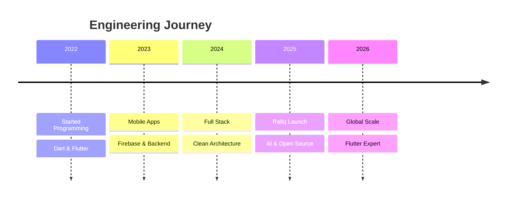

<!-- ═══════════════════════════════════════════════════════════════ -->
<!--                        HERO SECTION                           -->
<!-- ═══════════════════════════════════════════════════════════════ -->

 

<!-- Typing Animation -->

 
 

<!-- Social Links -->

 
 

<!-- Visitor Counter -->

 
 

<!-- ═══════════════════════════════════════════════════════════════ -->
<!--                         DIVIDER                                -->
<!-- ═══════════════════════════════════════════════════════════════ -->

 

<!-- ═══════════════════════════════════════════════════════════════ -->
<!--                        ABOUT SECTION                           -->
<!-- ═══════════════════════════════════════════════════════════════ -->

### About

**Software Engineer from Basrah, Iraq 🇮🇶**

I architect premium mobile applications with obsessive attention to detail.
From pixel-perfect interfaces to scalable backends — I build products that
serve people and solve real problems. Currently creating **Rafiq**, a world-class
Islamic platform built with Flutter.

 

<!-- Skill Badges -->

 

<!-- ═══════════════════════════════════════════════════════════════ -->
<!--                       FOCUSED WORK                             -->
<!-- ═══════════════════════════════════════════════════════════════ -->

 

### Currently Building

 

A complete Islamic experience built with Flutter — Quran, Prayer Times, Qibla,
Tasbeeh, Khatmah Tracker, Audio Quran, Daily Azkar, Home Widgets, and Offline Support.

 

<!-- ═══════════════════════════════════════════════════════════════ -->
<!--                     EXPERTISE SECTION                          -->
<!-- ═══════════════════════════════════════════════════════════════ -->

 

### Expertise

 

<!-- Mobile & Frontend -->

 
 

<!-- Backend & Database -->

 
 

<!-- Design & Tools -->

 

<!-- Architecture Badges -->

 
 

 

### Mobile Engineering

 

 

 

### Backend & APIs

 

 

 

### Design & Creative

 

 

 

### AI & Intelligence

 

 

<!-- ═══════════════════════════════════════════════════════════════ -->
<!--                     GITHUB ANALYTICS                           -->
<!-- ═══════════════════════════════════════════════════════════════ -->

 

### GitHub

 

<!-- Stats Cards -->

&nbsp;&nbsp;&nbsp;

 
 

<!-- Streak -->

 
 

<!-- Trophies -->

 
 

<!-- Contribution Activity -->

 
 

<!-- Contribution Snake -->

> **Snake** — requires [Platane/snk](https://github.com/Platane/snk) GitHub Action configured in your profile repo.

<picture>
  <source media="(prefers-color-scheme: dark)" srcset="https://raw.githubusercontent.com/xdc7-css/xdc7-css/output/github-snake-dark.svg" />
  <source media="(prefers-color-scheme: light)" srcset="https://raw.githubusercontent.com/xdc7-css/xdc7-css/output/github-snake.svg" />
  
</picture>

 

<!-- ═══════════════════════════════════════════════════════════════ -->
<!--                   PINNED REPOSITORIES                           -->
<!-- ═══════════════════════════════════════════════════════════════ -->

 

### Projects

 

 

<!-- ═══════════════════════════════════════════════════════════════ -->
<!--                     TIMELINE                                   -->
<!-- ═══════════════════════════════════════════════════════════════ -->

 

### Journey

 

 

<!-- ═══════════════════════════════════════════════════════════════ -->
<!--                      CONNECT SECTION                           -->
<!-- ═══════════════════════════════════════════════════════════════ -->

 

### Let's Build Something

 

 
 

<!-- ═══════════════════════════════════════════════════════════════ -->
<!--                        FOOTER                                  -->
<!-- ═══════════════════════════════════════════════════════════════ -->

 

 
 

*"Engineering is not about writing code. It's about crafting experiences that serve people."*

 

