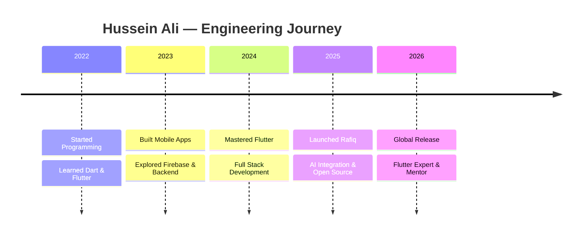

<div align="center">

<!-- Hero Banner -->


<!-- Typing SVG -->
<br/>


<br/>

<!-- Social Badges -->
<a href="https://github.com/xdc7-css">

</a>
<a href="https://www.linkedin.com/in/hussein-ali-">

</a>
<a href="mailto:hussein@example.com">

</a>
<a href="https://twitter.com/xdc7_css">

</a>

<br/>

<!-- Visitor Counter -->


</div>

<br/>

---

## ✦ About Me

```
╭──────────────────────────────────────────────────────────────────────╮
│                                                                      │
│   Software Engineer from Basrah, Iraq 🇮🇶                             │
│   Specializing in Flutter & Premium Mobile Apps                      │
│                                                                      │
│   I architect high-performance mobile applications with a focus on   │
│   clean code, elegant UI, and engineering excellence. From pixel-    │
│   perfect interfaces to scalable backends, I build products that     │
│   serve people and solve real problems.                              │
│                                                                      │
│   Currently building Rafiq — a premium Islamic platform designed     │
│   to bring spiritual technology to millions worldwide.               │
│                                                                      │
│   Every pixel is intentional. Every line of code is purposeful.      │
│                                                                      │
╰──────────────────────────────────────────────────────────────────────╯
```

<br/>

---

## ✦ Current Focus

<table>
<tr>
<td width="50%">

### 🔥 Building Rafiq
A premium Islamic platform built with **Flutter**.

Quran · Prayer Times · Qibla · Tasbeeh · Khatmah Tracker · Audio Quran · Daily Azkar · Islamic Notifications · Home Widgets · Offline Support · Premium UI · Beautiful Animations

</td>
<td width="50%">

### 🎯 2026 Goals

- Publish **Rafiq** globally
- Become a **Flutter Expert**
- Create premium mobile applications
- Contribute to **Open Source**
- Build useful **AI-powered** products
- Grow my GitHub presence
- Master **System Design** patterns
- Mentor aspiring developers

</td>
</tr>
</table>

<br/>

---

## ✦ Professional Summary

<div align="center">

| | |
|---|---|
| **Core Strengths** | Mobile App Development · UI/UX Design · System Architecture |
| **Approach** | Clean Code · Test-Driven · User-Centric · Detail-Obsessed |
| **Philosophy** | Build less, but build it right. Every product should serve a purpose. |
| **Tools of Choice** | Flutter · Dart · Firebase · Figma · VS Code |
| **Open Source** | Active contributor · Building for the community |
| **Vision** | Bridging technology and spirituality through premium software |

</div>

<br/>

---

## ✦ Technology Stack

<div align="center">

### Frontend & Mobile


### Backend & Database


### Tools & Design


### APIs & AI


</div>

<br/>

---

## ✦ Skill Icons

<div align="center">

[&perline=8)](https://skillicons.dev)

</div>

<br/>

---

## ✦ Featured Project

<table>
<tr>
<td width="25%" align="center">

</td>
<td width="75%">

### 🕌 Rafiq — Premium Islamic Platform

A beautifully crafted Flutter application providing a complete Islamic experience with premium UI and smooth animations.

| Feature | Description |
|---------|-------------|
| 📖 Quran | Full Quran with translations and recitations |
| 🕐 Prayer Times | Accurate prayer times with location-based calculations |
| 🧭 Qibla | Real-time Qibla compass direction |
| 📿 Tasbeeh | Digital tasbeeh counter with haptic feedback |
| 📊 Khatmah Tracker | Track your Quran completion journey |
| 🔊 Audio Quran | High-quality audio recitations |
| 🤲 Daily Azkar | Morning and evening adhkar |
| 🔔 Notifications | Islamic reminder notifications |
| 📱 Home Widgets | iOS and Android home screen widgets |
| 💾 Offline Support | Full offline functionality |

**Built with:** Flutter · Dart · Firebase · Clean Architecture · BLoC

</td>
</tr>
</table>

<br/>

---

## ✦ Flutter Expertise

<div align="center">

| Domain | Expertise |
|--------|-----------|
| **Architecture** | BLoC · Provider · GetX · MVVM · Clean Architecture |
| **State Management** | Flutter BLoC · Riverpod · Provider · GetX · Cubit |
| **Navigation** | GoRouter · Auto Route · Navigator 2.0 |
| **Networking** | Dio · HTTP · Retrofit · REST API Integration |
| **Local Storage** | Hive · SharedPreferences · SQLite · Drift |
| **Animations** | Implicit · Explicit · Staggered · Hero · Rive |
| **Testing** | Unit · Widget · Integration · Golden · Mocktail |
| **Platform** | Android · iOS · Web · Desktop |

</div>

<br/>

---

## ✦ Backend Expertise

<div align="center">

| Domain | Expertise |
|--------|-----------|
| **Frameworks** | FastAPI · Node.js · Express · Flask |
| **Databases** | PostgreSQL · Firestore · Supabase Postgres · MongoDB |
| **Auth** | Firebase Auth · Supabase Auth · JWT · OAuth 2.0 |
| **Cloud** | Firebase · Supabase · Vercel · Google Cloud |
| **APIs** | REST · GraphQL · WebSocket · Real-time |
| **DevOps** | Docker · GitHub Actions · CI/CD · Fastlane |

</div>

<br/>

---

## ✦ AI Experience

<div align="center">

| Area | Tools & Frameworks |
|------|-------------------|
| **LLM Integration** | OpenAI API · GPT-4 · LangChain |
| **On-device AI** | TensorFlow Lite · ML Kit · Core ML |
| **NLP** | Text Processing · Sentiment Analysis · Translation |
| **Automation** | AI-powered Workflows · Smart Notifications |
| **Vision** | Image Recognition · OCR · Camera AI |

</div>

<br/>

---

## ✦ Design Skills

<div align="center">

| Skill | Proficiency |
|-------|-------------|
| **UI Design** | Figma · Adobe XD · Sketch |
| **Prototyping** | Interactive Prototypes · Micro-interactions |
| **Design Systems** | Component Libraries · Design Tokens |
| **Typography** | Font Pairing · Responsive Type Scales |
| **Color Theory** | Dark Themes · Gradient Design · Accessibility |
| **Motion Design** | Lottie · Rive · CSS Animations |

</div>

<br/>

---

## ✦ GitHub Analytics

<div align="center">


&nbsp;&nbsp;


</div>

<br/>

---

## ✦ GitHub Streak

<div align="center">


</div>

<br/>

---

## ✦ Contribution Graph

<div align="center">


</div>

<br/>

---

## ✦ GitHub Trophies

<div align="center">

[](https://github.com/ryo-ma/github-profile-trophy)

</div>

<br/>

---

## ✦ Contribution Snake

<div align="center">

<picture>
  <source media="(prefers-color-scheme: dark)" srcset="https://raw.githubusercontent.com/xdc7-css/xdc7-css/output/github-snake-dark.svg" />
  <source media="(prefers-color-scheme: light)" srcset="https://raw.githubusercontent.com/xdc7-css/xdc7-css/output/github-snake.svg" />
  
</picture>

</div>

> **Note:** Requires [Platane/snk](https://github.com/Platane/snk) GitHub Action to be set up in your profile repo.

<br/>

---

## ✦ Featured Repositories

<div align="center">

<table>
<tr>
<td width="50%">

<a href="https://github.com/xdc7-css/rafiq">

</a>

</td>
<td width="50%">

<a href="https://github.com/xdc7-css/flutter-ui-kit">

</a>

</td>
</tr>
<tr>
<td width="50%">

<a href="https://github.com/xdc7-css/fastapi-backend">

</a>

</td>
<td width="50%">

<a href="https://github.com/xdc7-css/ai-tools">

</a>

</td>
</tr>
</table>

</div>

<br/>

---

## ✦ Timeline

<div align="center">



</div>

<br/>

---

## ✦ Open Source Contributions

<div align="center">

I believe in building in the open. Every project I create is designed with the community in mind.

[](https://github.com/xdc7-css)

</div>

<br/>

---

## ✦ Latest Activity

<!-- GitHub Activity Feed - Requires https://github.com/jamesgeorge007/github-activity-readme -->
<!-- Uncomment below once the action is configured in your profile repo:

<details>
<summary><b>Recent Activity</b></summary>


</details>

-->

<div align="center">

> 🔄 *Activity feed will appear here once the GitHub Activity Readme action is configured.*

</div>

<br/>

---

## ✦ Blog

<!-- Blog posts from your preferred platform (Hashnode, Dev.to, Medium) -->
<!-- Uncomment and configure once you have blog content:

<details>
<summary><b>Latest Blog Posts</b></summary>

- [Building Premium Islamic Apps with Flutter](https://your-blog.com/post-1)
- [Clean Architecture in Flutter: A Deep Dive](https://your-blog.com/post-2)
- [Why I Chose Flutter for Rafiq](https://your-blog.com/post-3)
- [Designing Dark Mode UIs That Users Love](https://your-blog.com/post-4)

</details>

-->

<div align="center">

> ✍️ *Blog posts coming soon — covering Flutter, UI/UX, and engineering insights.*

</div>

<br/>

---

## ✦ Certifications

<div align="center">

| Certification | Issuer | Year |
|:---:|:---:|:---:|
| Flutter Development | Google | 2024 |
| Firebase Certified | Google | 2024 |
| UI/UX Design | — | 2023 |
| Python for AI | — | 2025 |

> *More certifications in progress...*

</div>

<br/>

---

## ✦ Connect With Me

<div align="center">

<a href="https://github.com/xdc7-css">

</a>
<a href="https://linkedin.com/in/hussein-ali-">

</a>
<a href="https://twitter.com/xdc7_css">

</a>
<a href="mailto:hussein@example.com">

</a>
<a href="https://discord.gg/">

</a>

</div>

<br/>

---

## ✦ Contact

<table>
<tr>
<td width="50%">

### 📬 Get in Touch

I'm always interested in:
- Collaborating on **Flutter** projects
- Contributing to **Open Source**
- Building **premium mobile apps**
- **AI integration** in mobile applications

</td>
<td width="50%">

### 📋 Quick Info

| | |
|---|---|
| **Name** | Hussein Ali |
| **Username** | xdc7-css |
| **Role** | Software Engineer |
| **Location** | Basrah, Iraq 🇮🇶 |
| **Availability** | Open to opportunities |

</td>
</tr>
</table>

<br/>

---

## ✦ Fun Facts

<div align="center">

```
╔══════════════════════════════════════════════════════════╗
║                                                          ║
║   📍 Based in Basrah, Iraq — the city of oil & history  ║
║   💻 I write code that prays with the user               ║
║   🎨 Every pixel is intentional                           ║
║   ☕ Powered by coffee and conviction                     ║
║   🌙 Building apps that serve the Ummah                  ║
║   📱 Mobile-first, always                                 ║
║   🔧 Debugging is my cardio                               ║
║                                                          ║
╚══════════════════════════════════════════════════════════╝
```

</div>

<br/>

---

## ✦ Personal Philosophy

<div align="center">

> *"Engineering is not about writing code. It's about crafting experiences that serve people. Every line of code should be intentional, every pixel should be purposeful, and every product should solve a real problem."*

</div>

<br/>

---

## ✦ Inspirational Quote

<div align="center">


</div>

<br/>

---

<div align="center">

### Thank you for visiting my profile

<br/>


<br/>

---

**Built with precision. Powered by purpose.**

*Last updated: July 2026*

<br/>


</div>
