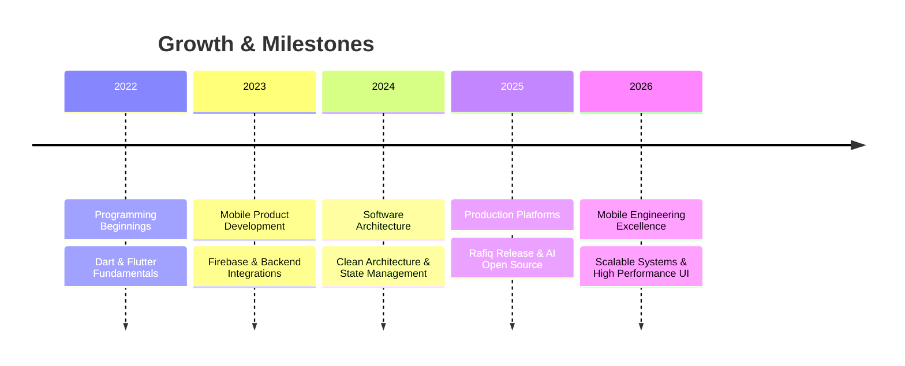

<!-- ═══════════════════════════════════════════════════════════════ -->
<!--                        HERO SECTION                           -->
<!-- ═══════════════════════════════════════════════════════════════ -->

 

<!-- Typing Animation -->

 
 

<!-- Social Badges -->

 
 

<!-- Visitor Counter -->

 
 

<!-- Section Separator -->

 

<!-- ═══════════════════════════════════════════════════════════════ -->
<!--                        ABOUT SECTION                           -->
<!-- ═══════════════════════════════════════════════════════════════ -->

### 💡 About Me

**Software Engineer & Mobile Architect from Basrah, Iraq 🇮🇶**

I architect high-performance mobile applications and resilient cloud backends with obsessive attention to detail. 
From micro-interactions and smooth 60fps animations to offline-first data synchronization — I build products that combine luxury design aesthetics with robust engineering.

 

<!-- Skill Badges -->

 

 

<!-- ═══════════════════════════════════════════════════════════════ -->
<!--                     FEATURED PROJECT                           -->
<!-- ═══════════════════════════════════════════════════════════════ -->

### 🚀 Currently Building

 

 

A comprehensive, offline-first Islamic companion app built with Flutter — featuring complete Quran audio streaming, precise Prayer Times, dynamic Qibla compass, Khatmah tracking, custom daily Azkar notifications, and home screen widgets.

 

 

 

<!-- ═══════════════════════════════════════════════════════════════ -->
<!--                     EXPERTISE SECTION                          -->
<!-- ═══════════════════════════════════════════════════════════════ -->

### 🛠️ Tech Stack & Expertise

 

<!-- Frontend & Mobile -->

 
 

<!-- Backend & Database -->

 
 

<!-- Design & Tools -->

 
 

<!-- Architectural Focus -->

 

 

<!-- ═══════════════════════════════════════════════════════════════ -->
<!--                     GITHUB ANALYTICS                           -->
<!-- ═══════════════════════════════════════════════════════════════ -->

### 📊 GitHub Activity & Metrics

 

<!-- Stats Cards -->

&nbsp;&nbsp;&nbsp;

 
 

<!-- Streak Stats -->

 
 

<!-- Profile Trophies -->

 
 

<!-- Activity Graph -->

 
 

<!-- Contribution Snake -->
<picture>
  <source media="(prefers-color-scheme: dark)" srcset="https://raw.githubusercontent.com/xdc7-css/xdc7-css/output/github-snake-dark.svg" />
  <source media="(prefers-color-scheme: light)" srcset="https://raw.githubusercontent.com/xdc7-css/xdc7-css/output/github-snake.svg" />
  
</picture>

 

 

<!-- ═══════════════════════════════════════════════════════════════ -->
<!--                   PINNED REPOSITORIES                           -->
<!-- ═══════════════════════════════════════════════════════════════ -->

### 📌 Featured Repositories

 

 

 

<!-- ═══════════════════════════════════════════════════════════════ -->
<!--                     TIMELINE                                   -->
<!-- ═══════════════════════════════════════════════════════════════ -->

### 🗺️ Engineering Journey

 

 

 

<!-- ═══════════════════════════════════════════════════════════════ -->
<!--                      CONNECT SECTION                           -->
<!-- ═══════════════════════════════════════════════════════════════ -->

### 🤝 Let's Connect & Collaborate

 

 
 

<!-- Footer Visitor Stats -->

 
 

*"Engineering is not about writing code. It's about crafting experiences that serve people."*

 

<!-- Footer Banner -->

